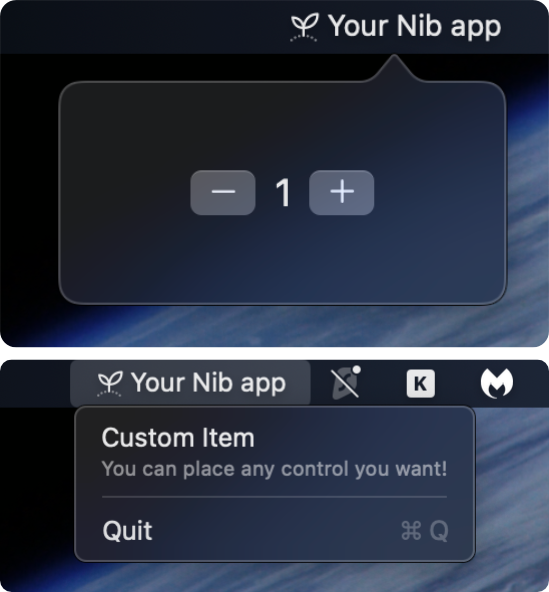

<h1 align="center">
  <span>
      
      <p>nib</p>
  </span>
</h1>

<p align="center">
  <b>Build native macOS menu bar apps in Python.</b>
</p>
<p align="center">
  Write your app logic in Python with a declarative, SwiftUI-inspired API. Nib compiles to a native macOS app with real SwiftUI rendering.
</p>


## Example

        
```python
import nib

def main(app: nib.App):
    app.icon = nib.SFSymbol(
        "apple.meditate", rendering_mode=nib.SymbolRenderingMode.HIERARCHICAL
    )
    app.title = "Your Nib app"
    app.menu = [
        nib.MenuItem(
            content=nib.VStack(
                controls=[
                    nib.Text("Custom Item"),
                    nib.Text(
                        "You can place any control you want!",
                        font=nib.Font.CAPTION,
                        foreground_color=nib.Color.WHITE.with_opacity(0.5),
                    ),
                ],
                alignment=nib.Alignment.LEADING,
            ),
            height=35,
        ),
        nib.MenuDivider(),
        nib.MenuItem("Quit", shortcut="cmd+q", action=app.quit),
    ]

    count = nib.Text("0", font=nib.Font.TITLE2)

    def increment():
        count.content = str(int(count.content) + 1)
    def decrement():
        count.content = str(int(count.content) - 1)

    app.build(
        nib.HStack(
            controls=[
                nib.Button(
                    content=nib.SFSymbol("minus"), 
                    action=decrement
                ),
                count,
                nib.Button(
                    content=nib.SFSymbol("plus"),
                    action=increment
                ),
            ]
        )
    )

nib.run(main)
```

## Why Nib?
Nib was born to fill a void in the Python ecosystem. Until now, the only way to create native macOS status bar apps was [rumps](https://github.com/jaredks/rumps), great for very simple apps, but limited in system integration and customization, with restrictive layout options.

Nib fills this gap:

- **Native performance** — Real SwiftUI rendering, smooth 60fps animations
- **Pythonic API** — Declarative syntax that feels natural, not a Swift wrapper
- **Reactive updates** — Change a property, UI updates automatically
- **Full system access** — Notifications, hotkeys, clipboard, file dialogs, drag & drop
- **Build & distribute** — Compile to a standalone `.app` bundle with `nib build`

## How It Works


Nib runs as two processes connected by a Unix socket. Your Python code builds a tree of view objects (`VStack`, `Text`, `Button`, etc.) and sends it to a Swift runtime, which renders it as real SwiftUI inside a menu bar popover. When the user interacts with the UI, Swift sends events back to Python, your callbacks run, and only the changed properties are patched through — never the full tree.

## Features

**UI Components** — Text, Button, TextField, Toggle, Slider, Picker, Image, List, ScrollView, Charts, and more

**Layout** — VStack, HStack, ZStack, Spacer, Divider, Form, Section, NavigationStack

**Styling** — Colors, gradients, shadows, animations, SF Symbols, custom fonts

**System Integration** — macOS notifications, global keyboard shortcuts, clipboard access, file/save dialogs, drag & drop

**Settings** — Built-in settings window with tabs, auto-persistence to UserDefaults

**Context Menu** — Right-click menu on the status bar icon with nested items, shortcuts, badges

## Installation

**Requirements:** macOS 14+, Python 3.10+

```bash
pip install nib
```

Or build from source:

```bash
git clone https://github.com/Bbalduzz/nib.git
cd nib
make install
```

## Quick Start

```bash
# Create a new project
nib create myapp
cd myapp

# Run in development mode (hot reload)
nib run main.py
```

## Building

Once you are satisfied with your project, nib lets you compile it into a standalone macOS `.app` bundle:

```bash
nib build main.py
```

The output is a self-contained app in `dist/`, it bundles a portable Python runtime, your code, and all dependencies. No Python installation needed on the target machine.

### Build options

| Flag | Description |
|------|-------------|
| `--native` | Compile Python to native `.so` modules via Cython (requires `pip install cython`) |
| `--obfuscate` | Strip debug info from `.pyc` bytecode (function names, filenames, line numbers) |
| `--no-compile` | Keep `.py` source files instead of compiling to `.pyc` |
| `--icon icon.png` | Custom app icon (`.png` or `.icns`) |
| `--name "My App"` | Override the app display name |
| `--arch arm64` | Target architecture (`arm64` or `x86_64`) |

```bash
# Native compilation — .py files become .so shared libraries
nib build main.py --native

# Obfuscated bytecode
nib build main.py --obfuscate

# Custom name and icon
nib build main.py --name "My App" --icon assets/icon.png
```

Build options can also be set in `pyproject.toml`:

```toml
[tool.nib]
entry = "src/main.py"

[tool.nib.build]
name = "My App"
icon = "assets/icon.png"
identifier = "com.example.myapp"
native = true
```

## License

MIT
