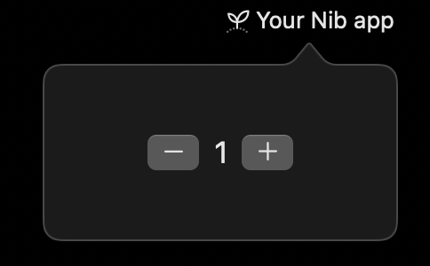

<h1 align="center">
  <span>
      
      <p>nib</p>
  </span>
</h1>

<p align="center">
  <b>Build native macOS menu bar apps in Python.</b>
</p>
<p align="center">
  Write your app logic in Python with a declarative, SwiftUI-inspired API. Nib compiles to a native macOS app with real SwiftUI rendering.
</p>


## Example

<table>
  <tr>
    <td valign="top">
        
```python
import nib

def main(app: nib.App):
    app.icon = nib.SFSymbol(
        "apple.meditate",
        rendering_mode=nib.SymbolRenderingMode.HIERARCHICAL
    )
    app.title = "Your Nib app"
    app.menu = [
        nib.MenuItem("Quit", shortcut="cmd+q", action=app.quit),
    ]

    count = nib.Text("0", font=nib.Font.TITLE2)

    def increment():
        count.content = str(int(count.content) + 1)

    def decrement():
        count.content = str(int(count.content) - 1)

    app.build(
        nib.HStack(
            controls=[
                nib.Button(
                    content=nib.SFSymbol("minus"),
                    action=decrement
                ),
                count,
                nib.Button(
                    content=nib.SFSymbol("plus"),
                    action=increment
                ),
            ]
        )
    )

nib.run(main)
```
</td>
    <td valign="top"></td>
  </tr>
</table>

## Why Nib?

- **Native performance** — Real SwiftUI rendering, smooth 60fps animations
- **Pythonic API** — Declarative syntax that feels natural, not a Swift wrapper
- **Reactive updates** — Change a property, UI updates automatically
- **Full system access** — Notifications, hotkeys, clipboard, file dialogs, drag & drop
- **Build & distribute** — Compile to a standalone `.app` bundle with `nib build`

## How It Works

```
┌─────────────────┐                        ┌─────────────────┐
│   Python App    │   Unix Socket + MsgPack│  Swift Runtime  │
│                 │ ◄─────────────────────►│                 │
│  Your code      │                        │  SwiftUI        │
│  View tree      │        render ───────► │  Status bar     │
│  Event handlers │ ◄─────── events        │  Native APIs    │
└─────────────────┘                        └─────────────────┘
```

Your Python code defines the UI as a tree of views. Nib serializes this tree and sends it to a Swift runtime process that renders native SwiftUI. User interactions flow back as events, triggering your Python callbacks.

The result: you write Python, users see a native Mac app.

## Features

**UI Components** — Text, Button, TextField, Toggle, Slider, Picker, Image, List, ScrollView, Charts, and more

**Layout** — VStack, HStack, ZStack, Spacer, Divider, Form, Section, NavigationStack

**Styling** — Colors, gradients, shadows, animations, SF Symbols, custom fonts

**System Integration** — macOS notifications, global keyboard shortcuts, clipboard access, file/save dialogs, drag & drop

**Settings** — Built-in settings window with tabs, auto-persistence to UserDefaults

**Context Menu** — Right-click menu on the status bar icon with nested items, shortcuts, badges

## Installation

**Requirements:** macOS 14+, Python 3.10+

```bash
pip install nib
```

Or build from source:

```bash
git clone https://github.com/nicebyte/nib.git
cd nib
make install
```

## Quick Start

```bash
# Create a new project
nib create myapp
cd myapp

# Run in development mode (hot reload)
nib run main.py

# Build a distributable .app
nib build
```

## License

MIT
