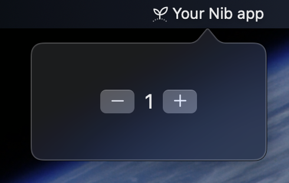

# Your First App

This tutorial walks through building a counter app from scratch. You will learn how to configure the app, create views, handle user interaction, and add a context menu.

## 1. Create the file

Create a new file called `main.py` and start with the Nib import:

```python
import nib
```

## 2. Define the main function

Nib uses a function-based entry point. Your `main` function receives an `App` instance that you configure:

```python
import nib


def main(app: nib.App):
    pass


nib.run(main)
```

`nib.run(main)` creates the app, calls your function, and starts the event loop. This is the recommended pattern for all Nib applications.

## 3. Configure the app

Set the title that appears next to the menu bar icon, the icon itself, and the popover window size:

```python
import nib


def main(app: nib.App):
    app.title = "Counter"
    app.icon = nib.SFSymbol("number.circle.fill")
    app.width = 280
    app.height = 200


nib.run(main)
```

!!! note
    `nib.SFSymbol` accepts any [SF Symbols](https://developer.apple.com/sf-symbols/) name. You can browse available symbols using the SF Symbols app from Apple.

## 4. Add views

Create a `Text` view to display the counter value and a `Button` to increment it:

```python
import nib


def main(app: nib.App):
    app.title = "Counter"
    app.icon = nib.SFSymbol("number.circle.fill")
    app.width = 280
    app.height = 200

    counter_display = nib.Text("0", font=nib.Font.TITLE)
    increment_button = nib.Button("Add +1")

    app.build(
        nib.VStack(
            controls=[counter_display, increment_button],
            spacing=12,
            padding=24,
        )
    )


nib.run(main)
```

`app.build()` sets the root view of the application. Here we use a `VStack` to lay out the text and button vertically. The `controls` parameter takes a list of child views.

## 5. Make it reactive

Define an action function and wire it to the button. When you mutate a view property, Nib automatically diffs the view tree and sends only the changes to the Swift runtime:

```python
import nib


def main(app: nib.App):
    app.title = "Counter"
    app.icon = nib.SFSymbol("number.circle.fill")
    app.width = 280
    app.height = 200

    count = 0
    counter_display = nib.Text("0", font=nib.Font.TITLE)

    def increment():
        nonlocal count
        count += 1
        counter_display.content = str(count)

    app.build(
        nib.VStack(
            controls=[
                counter_display,
                nib.Button("Add +1", action=increment),
            ],
            spacing=12,
            padding=24,
        )
    )


nib.run(main)
```

The key line is `counter_display.content = str(count)`. Assigning a new value to a view property triggers an automatic re-render -- no manual state management, no observers, no signals. Just mutate the property and the UI updates.

!!! tip
    Every view property that affects the UI is reactive. For example, changing `button.foreground_color = nib.Color.RED` or `text.font = nib.Font.CAPTION` will re-render instantly.

## 6. Add a context menu

The context menu appears when the user right-clicks the menu bar icon. Define it with `app.menu`:

```python
import nib


def main(app: nib.App):
    app.title = "Counter"
    app.icon = nib.SFSymbol("number.circle.fill")
    app.width = 280
    app.height = 200

    count = 0
    counter_display = nib.Text("0", font=nib.Font.TITLE)

    def increment():
        nonlocal count
        count += 1
        counter_display.content = str(count)

    def reset():
        nonlocal count
        count = 0
        counter_display.content = "0"

    app.menu = [
        nib.MenuItem("Reset Counter", action=reset, icon="arrow.counterclockwise"),
        nib.MenuDivider(),
        nib.MenuItem("Quit", action=app.quit, icon="power"),
    ]

    app.build(
        nib.VStack(
            controls=[
                counter_display,
                nib.Button("Add +1", action=increment),
            ],
            spacing=12,
            padding=24,
        )
    )


nib.run(main)
```

`MenuItem` accepts a title, an action callback, and an optional SF Symbol icon. `MenuDivider` inserts a separator line.

## 7. Run it

Save the file and launch it:

```bash
nib run main.py
```

Click the icon in your menu bar to open the popover. Press the button to increment the counter. Right-click the icon to see the context menu.



## Complete code

Here is the full application in one file:

```python
"""Counter - A simple Nib menu bar app."""

import nib


def main(app: nib.App):
    app.title = "Counter"
    app.icon = nib.SFSymbol("number.circle.fill")
    app.width = 280
    app.height = 200

    count = 0
    counter_display = nib.Text("0", font=nib.Font.TITLE)

    def increment():
        nonlocal count
        count += 1
        counter_display.content = str(count)

    def reset():
        nonlocal count
        count = 0
        counter_display.content = "0"

    app.menu = [
        nib.MenuItem("Reset Counter", action=reset, icon="arrow.counterclockwise"),
        nib.MenuDivider(),
        nib.MenuItem("Quit", action=app.quit, icon="power"),
    ]

    app.build(
        nib.VStack(
            controls=[
                nib.Text("Counter", font=nib.Font.HEADLINE),
                counter_display,
                nib.Button("Add +1", action=increment),
            ],
            spacing=12,
            padding=24,
        )
    )


nib.run(main)
```

## Class-based approach

Nib also supports a class-based pattern where you subclass `nib.App` and override the `body` method. This can be useful for smaller apps or when you prefer an object-oriented style:

```python
import nib


class MyApp(nib.App):
    def body(self) -> nib.View:
        return nib.VStack(
            controls=[
                nib.Text("Hello from Nib!", font=nib.Font.TITLE),
                nib.Text("A class-based app.", foreground_color=nib.Color.GRAY),
            ],
            spacing=8,
            padding=24,
        )


MyApp(icon="star.fill").run()
```

The constructor accepts `title`, `icon`, and `identifier` parameters. Call `.run()` to start the application.

!!! note
    The function-based approach (`nib.run(main)`) is recommended for most apps because it keeps setup logic in a single function and avoids the need for subclassing. The class-based approach does not support reactive property mutations in the same way -- it is better suited for static UIs.

## Next steps

- [Project Structure](project-structure.md) -- Learn about assets, fonts, and the `pyproject.toml` configuration.
