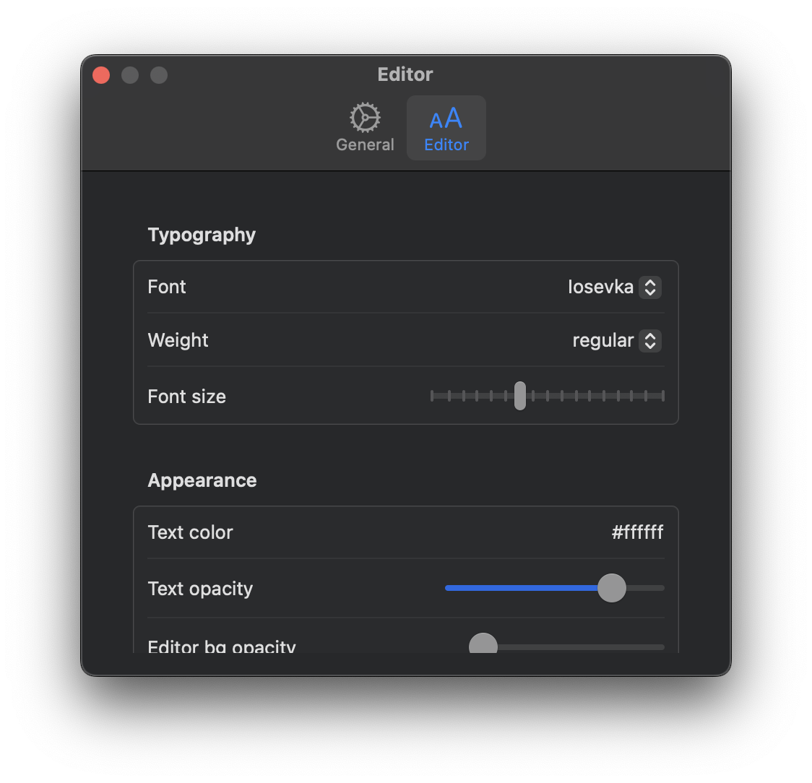

# SettingsPage & SettingsTab



Components for creating tabbed preferences windows that follow macOS conventions. `SettingsPage` defines the window, and `SettingsTab` defines each tab within it. The settings window is accessible via Cmd+, (standard macOS shortcut) or programmatically via the `open()` method.

---

## SettingsPage

### Constructor

```python
nib.SettingsPage(
    tabs=None,
    content=None,
    width=450,
    height=300,
    title="Settings",
)
```

### Parameters

| Parameter | Type | Default | Description |
|---|---|---|---|
| `tabs` | `list[SettingsTab] \| None` | `None` | List of `SettingsTab` objects for a tabbed interface |
| `content` | `View \| None` | `None` | Single view for a non-tabbed settings page. If provided without `tabs`, automatically wraps in a single "General" tab with a gear icon |
| `width` | `float` | `450` | Window width in points |
| `height` | `float` | `300` | Window height in points |
| `title` | `str` | `"Settings"` | Window title text |

### Properties

| Property | Type | Description |
|---|---|---|
| `tabs` | `list[SettingsTab]` | The list of tabs in the settings page |
| `content` | `View \| None` | Single content view (if provided at construction) |
| `width` | `float` | Window width |
| `height` | `float` | Window height |
| `title` | `str` | Window title |

### Methods

#### `open()`

Open the settings window programmatically.

```python
settings_page.open() -> None
```

#### `close()`

Close the settings window programmatically.

```python
settings_page.close() -> None
```

---

## SettingsTab

### Constructor

```python
nib.SettingsTab(title, icon=None, content=None)
```

### Parameters

| Parameter | Type | Default | Description |
|---|---|---|---|
| `title` | `str` | -- | The tab title displayed in the tab bar |
| `icon` | `str \| None` | `None` | SF Symbol name for the tab icon (e.g. `"gear"`, `"person"`, `"bell"`) |
| `content` | `View \| None` | `None` | The view displayed when this tab is selected |

### Properties

| Property | Type | Description |
|---|---|---|
| `title` | `str` | Tab title text |
| `icon` | `str \| None` | SF Symbol icon name |
| `content` | `View \| None` | Tab content view |

---

## Examples

### Multi-tab settings page

```python
import nib

def main(app: nib.App):
    app.title = "My App"
    app.icon = nib.SFSymbol("star.fill")
    app.width = 300
    app.height = 200

    settings = nib.Settings({
        "dark_mode": False,
        "font_size": 14,
        "notifications": True,
    })
    app.register_settings(settings)

    app.settings = nib.SettingsPage(
        width=500,
        height=400,
        tabs=[
            nib.SettingsTab(
                "General",
                icon="gear",
                content=nib.Form(
                    controls=[
                        nib.Toggle(
                            "Dark Mode",
                            is_on=settings.dark_mode,
                            on_change=lambda v: setattr(settings, "dark_mode", v),
                        ),
                        nib.Slider(
                            "Font Size",
                            value=settings.font_size,
                            min_value=10,
                            max_value=24,
                            on_change=lambda v: settings.set("font_size", int(v)),
                        ),
                    ],
                ),
            ),
            nib.SettingsTab(
                "Notifications",
                icon="bell",
                content=nib.Form(
                    controls=[
                        nib.Toggle(
                            "Enable Notifications",
                            is_on=settings.notifications,
                            on_change=lambda v: setattr(settings, "notifications", v),
                        ),
                    ],
                ),
            ),
        ],
    )

    app.menu = [
        nib.MenuItem("Settings", action=app.settings.open, icon="gear", shortcut="cmd+,"),
        nib.MenuDivider(),
        nib.MenuItem("Quit", action=app.quit),
    ]

    app.build(
        nib.Text("Right-click for settings", padding=20)
    )

nib.run(main)
```

### Simple single-view settings (no tabs)

```python
import nib

def main(app: nib.App):
    app.title = "Simple App"
    app.icon = nib.SFSymbol("circle")
    app.width = 300
    app.height = 100

    app.settings = nib.SettingsPage(
        content=nib.VStack(
            controls=[
                nib.Text("Preferences", font=nib.Font.HEADLINE),
                nib.Toggle("Enable feature", is_on=True),
            ],
            spacing=12,
            padding=20,
        ),
        width=400,
        height=200,
    )

    app.build(
        nib.VStack(
            controls=[
                nib.Text("Hello!", padding=10),
                nib.Button("Open Settings", action=app.settings.open),
            ],
            spacing=8,
            padding=16,
        )
    )

nib.run(main)
```

### Opening settings from a button

```python
import nib

def main(app: nib.App):
    app.title = "App"
    app.icon = nib.SFSymbol("app")
    app.width = 300
    app.height = 150

    app.settings = nib.SettingsPage(
        tabs=[
            nib.SettingsTab(
                "Account",
                icon="person.circle",
                content=nib.VStack(
                    controls=[
                        nib.TextField(value="", placeholder="Username"),
                        nib.SecureField(placeholder="Password"),
                    ],
                    spacing=10,
                    padding=20,
                ),
            ),
            nib.SettingsTab(
                "Advanced",
                icon="wrench.and.screwdriver",
                content=nib.VStack(
                    controls=[
                        nib.Toggle("Debug Mode", is_on=False),
                        nib.Toggle("Verbose Logging", is_on=False),
                    ],
                    spacing=10,
                    padding=20,
                ),
            ),
        ],
    )

    app.build(
        nib.VStack(
            controls=[
                nib.Text("Welcome", font=nib.Font.TITLE),
                nib.Button(
                    content=nib.HStack(
                        controls=[
                            nib.SFSymbol("gear"),
                            nib.Text("Preferences"),
                        ],
                        spacing=6,
                    ),
                    action=app.settings.open,
                ),
            ],
            spacing=12,
            padding=20,
        )
    )

nib.run(main)
```

## Related

- [App](app.md) -- Assign via `app.settings` and use `app.open_settings()` / `app.close_settings()`
- [Settings](settings.md) -- Persistent settings data that pairs with the settings UI
- [MenuItem](menu.md) -- Add a "Settings" menu item that opens the preferences window
