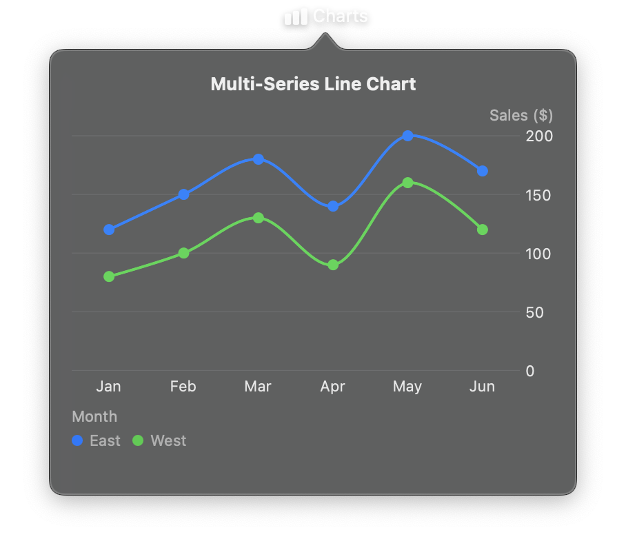

# Chart



The main container for displaying data visualizations using Swift Charts. Chart manages the dataset, one or more marks, axis configuration, and legend settings. Data is provided as a list of dictionaries (row-based) and is automatically converted to an efficient columnar format for the Swift runtime.

Charts are reactive -- updating the `data` property or calling helper methods like `append_data()` triggers an automatic re-render.

## Constructor

```python
nib.Chart(
    data,
    marks,
    x_axis=None,
    y_axis=None,
    legend=None,
    chart_background=None,
    plot_background=None,
    **modifiers,
)
```

## Parameters

| Parameter | Type | Default | Description |
|-----------|------|---------|-------------|
| `data` | `list[dict[str, Any]]` | *required* | Data points as a list of dictionaries. Each dictionary is a row with column names as keys. Keys must match the field names referenced in your marks. |
| `marks` | `list[BaseMark]` | *required* | Chart marks that define how data is visualized. Supports `LineMark`, `BarMark`, `AreaMark`, `PointMark`, `RuleMark`, `RectMark`, and `SectorMark`. Multiple marks can be combined for layered visualizations. |
| `x_axis` | `ChartAxis` | `None` | Configuration for the X-axis. Controls label, grid lines, position, and formatting. |
| `y_axis` | `ChartAxis` | `None` | Configuration for the Y-axis. Controls label, grid lines, position, and formatting. |
| `legend` | `ChartLegend \| bool` | `None` | Legend configuration. Pass a `ChartLegend` instance for custom positioning, `False` to hide the legend, or `None` for automatic behavior. |
| `chart_background` | `str` | `None` | Background color for the entire chart container including axes and legend. Accepts hex strings (e.g., `"#1a1a1a"`) or named colors. |
| `plot_background` | `str` | `None` | Background color for the plot area only (where data is rendered). Accepts hex strings or named colors. |
| `**modifiers` | | | Common view modifiers: `width`, `height`, `padding`, `opacity`, `corner_radius`, `border_color`, `border_width`, `shadow_radius`, etc. |

## Mutable Properties

| Property | Type | Description |
|----------|------|-------------|
| `data` | `list[dict[str, Any]]` | Get or set the chart data. Setting triggers a full re-render. |

## Methods

| Method | Signature | Description |
|--------|-----------|-------------|
| `append_data` | `append_data(row: dict)` | Appends a single row and re-renders. Useful for real-time charts. |
| `update_data` | `update_data(index: int, row: dict)` | Replaces the row at `index` with new values and re-renders. Silently ignored if the index is out of bounds. |
| `clear_data` | `clear_data()` | Removes all data points and re-renders. |

## Examples

### Basic line chart

```python
import nib

def main(app: nib.App):
    chart = nib.Chart(
        data=[
            {"month": "Jan", "sales": 100},
            {"month": "Feb", "sales": 150},
            {"month": "Mar", "sales": 200},
        ],
        marks=[nib.LineMark(x="month", y="sales")],
        width=300,
        height=200,
    )

    app.build(chart)

nib.run(main)
```

### Chart with axes and legend

```python
import nib

def main(app: nib.App):
    sales_data = [
        {"category": "Electronics", "value": 420},
        {"category": "Clothing", "value": 310},
        {"category": "Food", "value": 280},
        {"category": "Books", "value": 190},
    ]

    chart = nib.Chart(
        data=sales_data,
        marks=[nib.BarMark(x="category", y="value", foreground_style="#10B981")],
        x_axis=nib.ChartAxis(label="Category"),
        y_axis=nib.ChartAxis(label="Sales ($)", grid_lines=True),
        legend=nib.ChartLegend(position="bottom"),
        width=400,
        height=300,
        padding=16,
    )

    app.build(chart)

nib.run(main)
```

### Multi-series chart

```python
import nib

def main(app: nib.App):
    data = [
        {"month": "Jan", "revenue": 100, "expenses": 80},
        {"month": "Feb", "revenue": 150, "expenses": 90},
        {"month": "Mar", "revenue": 200, "expenses": 110},
    ]

    chart = nib.Chart(
        data=data,
        marks=[
            nib.LineMark(x="month", y="revenue", foreground_style="blue"),
            nib.LineMark(x="month", y="expenses", foreground_style="red"),
        ],
        width=400,
        height=250,
    )

    app.build(chart)

nib.run(main)
```

### Styled chart with backgrounds

```python
import nib

def main(app: nib.App):
    chart = nib.Chart(
        data=[
            {"x": 1, "y": 10},
            {"x": 2, "y": 25},
            {"x": 3, "y": 18},
            {"x": 4, "y": 32},
        ],
        marks=[nib.LineMark(x="x", y="y", foreground_style="#8B5CF6")],
        chart_background="#1a1a1a",
        plot_background="#262626",
        x_axis=nib.ChartAxis(label_color="#999999"),
        y_axis=nib.ChartAxis(grid_lines=True, grid_color="#333333"),
        width=400,
        height=300,
        padding=16,
        corner_radius=12,
    )

    app.build(chart)

nib.run(main)
```

### Real-time data updates

```python
import nib
import time
import random
import threading

def main(app: nib.App):
    chart = nib.Chart(
        data=[],
        marks=[nib.LineMark(x="t", y="value", foreground_style="#3B82F6")],
        width=400,
        height=200,
    )

    app.build(chart)

    def stream():
        for t in range(100):
            chart.append_data({"t": t, "value": random.randint(0, 100)})
            time.sleep(0.5)

    threading.Thread(target=stream, daemon=True).start()

nib.run(main)
```
