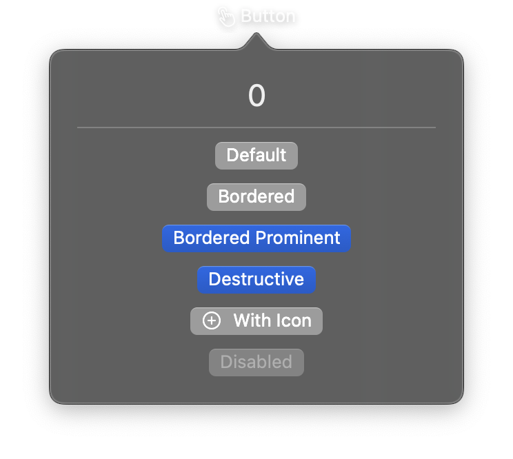

# Button



A control that initiates an action when tapped. Buttons can display a text label, an SF Symbol icon, or fully custom content views. Various styles and semantic roles can be applied to communicate the button's purpose.

## Constructor

```python
nib.Button(
    label=None,
    icon=None,
    action=None,
    content=None,
    style=None,
    role=None,
    border_shape=None,
    control_size=None,
    label_style=None,
    tint=None,
    disabled=False,
    **modifiers,
)
```

## Parameters

| Parameter | Type | Default | Description |
|-----------|------|---------|-------------|
| `label` | `str` | `None` | Text displayed on the button. |
| `icon` | `str` | `None` | SF Symbol name for the button icon (e.g., `"gear"`, `"trash"`, `"star.fill"`). Can be combined with `label`. |
| `action` | `Callable` | `None` | Callback function executed when the button is tapped. Should accept no arguments. |
| `content` | `View` | `None` | Custom view to use as button content. Alternative to `label`/`icon`. |
| `style` | `ButtonStyle \| str` | `None` | Visual style. Options: `ButtonStyle.automatic`, `ButtonStyle.bordered`, `ButtonStyle.borderedProminent`, `ButtonStyle.borderless`, `ButtonStyle.plain`. |
| `role` | `ButtonRole \| str` | `None` | Semantic role affecting appearance. Options: `ButtonRole.destructive` (red tint), `ButtonRole.cancel`. |
| `border_shape` | `BorderShape \| str` | `None` | Shape of the button border. Options: `BorderShape.automatic`, `BorderShape.capsule`, `BorderShape.roundedRectangle`. |
| `control_size` | `ControlSize \| str` | `None` | Size of the control. Options: `ControlSize.mini`, `ControlSize.small`, `ControlSize.regular`, `ControlSize.large`. |
| `label_style` | `LabelStyle \| str` | `None` | Style for the label content. Options: `LabelStyle.automatic`, `LabelStyle.titleOnly`, `LabelStyle.iconOnly`, `LabelStyle.titleAndIcon`. |
| `tint` | `Color \| str` | `None` | Tint color for the button. Accepts a `Color` enum, hex string, or RGB tuple. |
| `disabled` | `bool` | `False` | Whether the button is disabled and non-interactive. |
| `**modifiers` | | | Common view modifiers: `padding`, `background`, `foreground_color`, `opacity`, `corner_radius`, etc. |

## Examples

### Simple text button

```python
import nib

def main(app: nib.App):
    def greet():
        print("Hello!")

    app.build(
        nib.Button("Say Hello", action=greet, padding=16)
    )

nib.run(main)
```

### Styled buttons with roles

```python
import nib

def main(app: nib.App):
    app.build(
        nib.VStack(controls=[
            nib.Button(
                "Save",
                icon="checkmark",
                action=lambda: print("Saved"),
                style=nib.ButtonStyle.borderedProminent,
                control_size=nib.ControlSize.large,
            ),
            nib.Button(
                "Delete",
                icon="trash",
                action=lambda: print("Deleted"),
                role=nib.ButtonRole.destructive,
                style=nib.ButtonStyle.bordered,
            ),
            nib.Button(
                "Cancel",
                action=lambda: print("Cancelled"),
                role=nib.ButtonRole.cancel,
            ),
        ], spacing=8, padding=16)
    )

nib.run(main)
```

### Button with custom content

```python
import nib

def main(app: nib.App):
    app.build(
        nib.Button(
            content=nib.HStack(controls=[
                nib.Image(system_name="star.fill"),
                nib.Text("Favorite"),
            ], spacing=4),
            action=lambda: print("Favorited"),
            style=nib.ButtonStyle.bordered,
            tint=nib.Color.YELLOW,
            padding=16,
        )
    )

nib.run(main)
```
