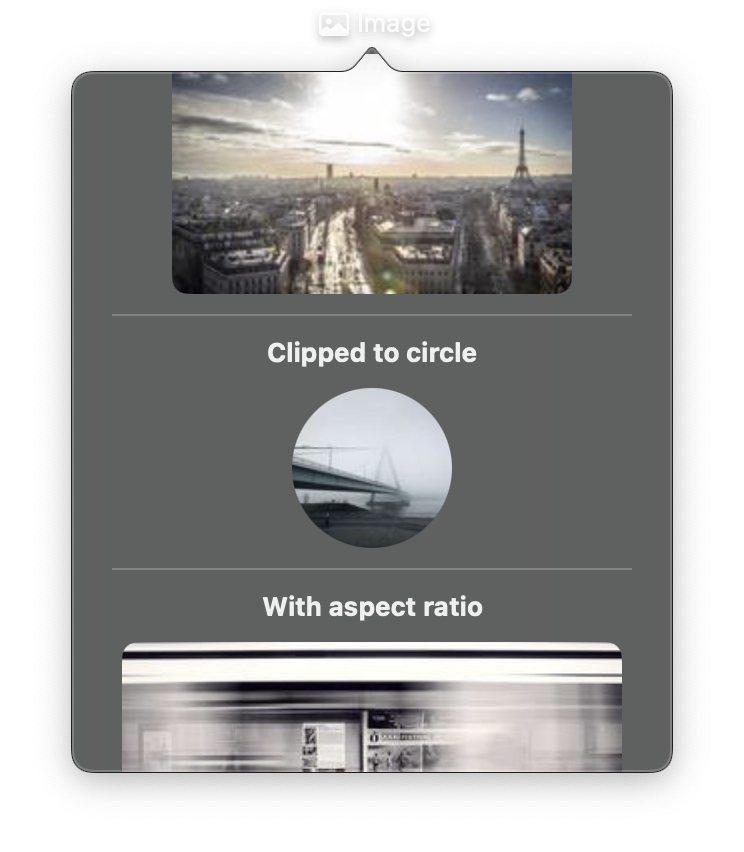

# Image



A view that displays an image from various sources: remote URLs, local file paths, project asset references, or raw bytes. The `src` property is reactive -- changing it triggers an immediate UI update with the new image.

## Constructor

```python
nib.Image(
    src=None,
    label=None,
    aspect_ratio=None,
    antialiased=True,
    blur=None,
    **modifiers,
)
```

## Parameters

| Parameter | Type | Default | Description |
|-----------|------|---------|-------------|
| `src` | `str \| bytes` | `None` | Image source. Supports remote URLs (`"https://..."`), absolute file paths (`"/path/to/image.png"`), asset references (`"logo.png"` resolves to `assets/logo.png`), or raw `bytes` containing image data. |
| `label` | `str` | `None` | Accessibility label describing the image content. Important for VoiceOver and assistive technologies. |
| `aspect_ratio` | `ContentMode \| str` | `None` | How to scale the image within its frame. Options: `ContentMode.FIT` (fit within bounds, may letterbox), `ContentMode.FILL` (fill bounds, may crop). |
| `antialiased` | `bool` | `True` | Whether to apply antialiasing for smoother edges. Set to `False` for pixel-art or sharp edges. |
| `blur` | `float` | `None` | Blur radius to apply to the image. Higher values create a stronger blur effect. |
| `**modifiers` | | | Common view modifiers: `width`, `height`, `corner_radius`, `clip_shape`, `opacity`, `shadow_color`, `shadow_radius`, `padding`, etc. |

## Mutable Properties

| Property | Type | Description |
|----------|------|-------------|
| `src` | `str \| bytes` | Get or set the image source. Setting triggers a UI update. |
| `label` | `str` | Get or set the accessibility label. Setting triggers a UI update. |

## Examples

### Remote image with aspect ratio

```python
import nib

def main(app: nib.App):
    app.build(
        nib.Image(
            src="https://example.com/photo.jpg",
            label="Landscape photo",
            aspect_ratio=nib.ContentMode.FIT,
            width=300,
            height=200,
            corner_radius=12,
            padding=16,
        )
    )

nib.run(main)
```

### Circular avatar from asset

```python
import nib

def main(app: nib.App):
    app.build(
        nib.HStack(controls=[
            nib.Image(
                src="avatar.png",
                label="User avatar",
                aspect_ratio=nib.ContentMode.FILL,
                clip_shape=nib.Circle(),
                width=48,
                height=48,
            ),
            nib.VStack(controls=[
                nib.Text("Jane Doe", font=nib.Font.HEADLINE),
                nib.Text("Online", foreground_color=nib.Color.GREEN,
                          font=nib.Font.CAPTION),
            ], spacing=2),
        ], spacing=12, padding=16)
    )

nib.run(main)
```

### Reactive image switching

```python
import nib

def main(app: nib.App):
    images = [
        "https://example.com/photo1.jpg",
        "https://example.com/photo2.jpg",
        "https://example.com/photo3.jpg",
    ]
    index = [0]
    photo = nib.Image(
        src=images[0],
        label="Photo",
        aspect_ratio=nib.ContentMode.FIT,
        width=250,
        height=180,
        corner_radius=8,
    )

    def next_image():
        index[0] = (index[0] + 1) % len(images)
        photo.src = images[index[0]]

    app.build(
        nib.VStack(controls=[
            photo,
            nib.Button("Next", action=next_image),
        ], spacing=12, padding=16)
    )

nib.run(main)
```
