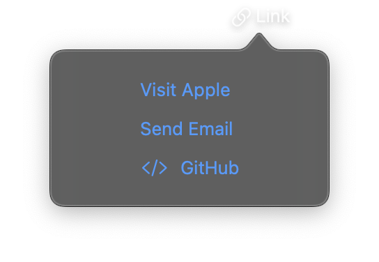

# Link



A clickable element that opens a URL in the system's default web browser when tapped. Links can display a simple text title or custom content views. The URL can use any scheme supported by the system, including `https://`, `mailto:`, and `tel:`.

## Constructor

```python
nib.Link(
    title=None,
    url="",
    content=None,
    **modifiers,
)
```

## Parameters

| Parameter | Type | Default | Description |
|-----------|------|---------|-------------|
| `title` | `str` | `None` | Text to display as the link. For custom content, use the `content` parameter instead. |
| `url` | `str` | `""` | The URL to open when the link is tapped. Supports `http://`, `https://`, `mailto:`, `tel:`, and other system URL schemes. |
| `content` | `View` | `None` | Custom view to display as the link content. Alternative to `title`. |
| `**modifiers` | | | Common view modifiers: `foreground_color`, `font`, `padding`, `opacity`, etc. |

## Examples

### Simple text link

```python
import nib

def main(app: nib.App):
    app.build(
        nib.VStack(controls=[
            nib.Link(
                "Visit our website",
                url="https://example.com",
                foreground_color=nib.Color.BLUE,
            ),
            nib.Link(
                "Contact Support",
                url="mailto:support@example.com",
                foreground_color=nib.Color.BLUE,
            ),
        ], spacing=12, padding=16)
    )

nib.run(main)
```

### Link with custom content

```python
import nib

def main(app: nib.App):
    app.build(
        nib.Link(
            url="https://github.com/user/repo",
            content=nib.HStack(controls=[
                nib.Image(system_name="globe"),
                nib.Text("View on GitHub",
                          font=nib.Font.BODY),
            ], spacing=4),
            foreground_color=nib.Color.BLUE,
            padding=16,
        )
    )

nib.run(main)
```

### Links in a settings list

```python
import nib

def main(app: nib.App):
    app.build(
        nib.VStack(controls=[
            nib.Text("About", style=nib.TextStyle.TITLE),
            nib.Link("Documentation",
                      url="https://docs.example.com"),
            nib.Link("Release Notes",
                      url="https://example.com/releases"),
            nib.Link("Privacy Policy",
                      url="https://example.com/privacy"),
        ], spacing=8, padding=16)
    )

nib.run(main)
```
