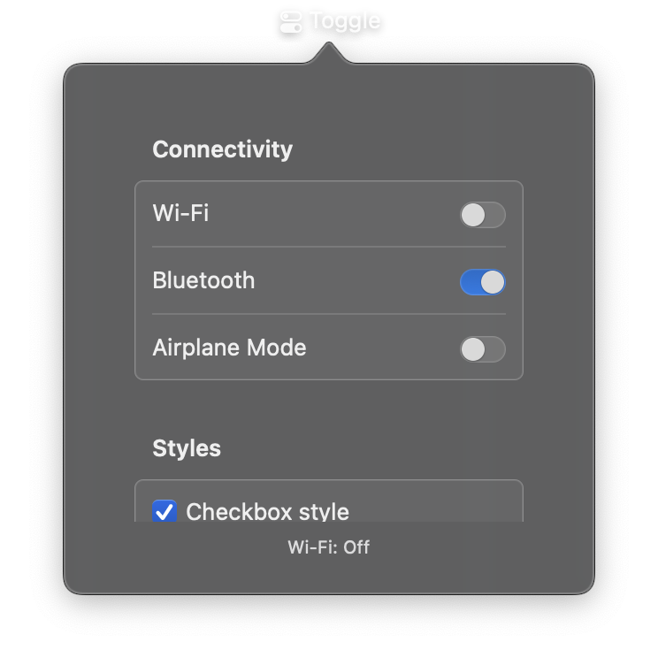

# Toggle



A control for switching between on and off states. Toggle provides a binary switch that users can tap to change. It can display a text label or custom content, and triggers a callback when the state changes.

## Constructor

```python
nib.Toggle(
    label=None,
    is_on=False,
    on_change=None,
    content=None,
    style=None,
    tint=None,
    disabled=False,
    **modifiers,
)
```

## Parameters

| Parameter | Type | Default | Description |
|-----------|------|---------|-------------|
| `label` | `str` | `None` | Text displayed next to the toggle switch. |
| `is_on` | `bool` | `False` | Initial on/off state. `True` for on, `False` for off. |
| `on_change` | `Callable[[bool], None]` | `None` | Callback called when the toggle state changes. Receives a boolean indicating the new state. |
| `content` | `View` | `None` | Custom view to display as the toggle label. Alternative to `label`. |
| `style` | `ToggleStyle \| str` | `None` | Visual style. Options: `ToggleStyle.automatic`, `ToggleStyle.switch`, `ToggleStyle.checkbox`, `ToggleStyle.button`. |
| `tint` | `Color \| str` | `None` | Tint color for the toggle in the "on" state. Accepts a `Color` enum, hex string, or RGB tuple. |
| `disabled` | `bool` | `False` | Whether the toggle is disabled and non-interactive. |
| `**modifiers` | | | Common view modifiers: `padding`, `background`, `foreground_color`, `opacity`, etc. |

## Examples

### Basic toggle switch

```python
import nib

def main(app: nib.App):
    status = nib.Text("Off")

    def on_toggle(is_on: bool):
        status.content = "On" if is_on else "Off"

    app.build(
        nib.VStack(controls=[
            nib.Toggle(
                "Enable notifications",
                is_on=False,
                on_change=on_toggle,
            ),
            status,
        ], spacing=12, padding=16)
    )

nib.run(main)
```

### Settings panel with styled toggles

```python
import nib

def main(app: nib.App):
    def log_change(name):
        return lambda is_on: print(f"{name}: {is_on}")

    app.build(
        nib.VStack(controls=[
            nib.Text("Settings", style=nib.TextStyle.TITLE),
            nib.Toggle("Dark Mode", is_on=True,
                        on_change=log_change("Dark Mode"),
                        tint=nib.Color.BLUE),
            nib.Toggle("Airplane Mode", is_on=False,
                        on_change=log_change("Airplane Mode"),
                        tint=nib.Color.ORANGE),
            nib.Toggle("I agree to terms", is_on=False,
                        on_change=log_change("Terms"),
                        style=nib.ToggleStyle.checkbox),
        ], spacing=12, padding=16)
    )

nib.run(main)
```

### Toggle with custom content

```python
import nib

def main(app: nib.App):
    app.build(
        nib.Toggle(
            content=nib.Label("Wi-Fi", icon="wifi"),
            is_on=True,
            on_change=lambda on: print(f"Wi-Fi: {on}"),
            tint=nib.Color.GREEN,
            padding=16,
        )
    )

nib.run(main)
```
