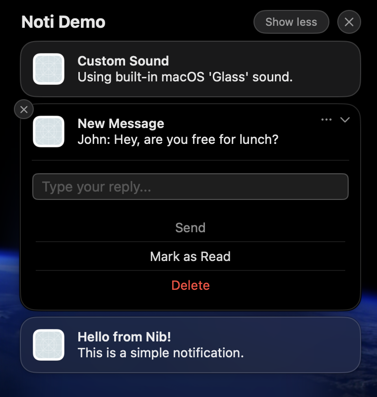

# Notification



The `Notification` dataclass represents a single macOS notification. It holds the content (title, body, subtitle), optional sound configuration, and optional action buttons.

```python
notification = nib.Notification(
    title="Download Complete",
    body="Your file has been saved",
)
app.notifications.push(notification)
```

## Constructor

```python
nib.Notification(
    title: str,
    body: str = "",
    subtitle: str = "",
    sound: NotificationSound | None = None,
    actions: list[NotificationAction] = [],
    id: str | None = None,
)
```

## Parameters

| Parameter | Type | Default | Description |
|-----------|------|---------|-------------|
| `title` | `str` | -- | The main title of the notification (required) |
| `body` | `str` | `""` | The body text displayed below the title |
| `subtitle` | `str` | `""` | A secondary line of text displayed below the title and above the body |
| `sound` | `NotificationSound \| None` | `None` | Sound configuration. Pass `NotificationSound()` for the default sound, or configure a custom sound |
| `actions` | `list[NotificationAction]` | `[]` | List of action buttons displayed on the notification |
| `id` | `str \| None` | Auto-generated UUID | Unique identifier for this notification. Used for canceling or querying. Auto-generated if not provided |

## Properties

| Property | Type | Description |
|----------|------|-------------|
| `title` | `str` | The notification title |
| `body` | `str` | The notification body text |
| `subtitle` | `str` | The notification subtitle |
| `sound` | `NotificationSound \| None` | Sound configuration |
| `actions` | `list[NotificationAction]` | Action buttons |
| `id` | `str` | Unique notification identifier |

## Methods

### `to_dict()`

Convert the notification to a dictionary for serialization. Used internally when sending to the Swift runtime.

```python
notification.to_dict() -> dict
```

### `Notification.from_dict(data)`

Class method to create a `Notification` from a dictionary. Used internally when receiving notification data from the Swift runtime.

```python
Notification.from_dict(data: dict) -> Notification
```

---

## Examples

### Simple notification

```python
import nib

def main(app: nib.App):
    app.title = "Notify"
    app.icon = nib.SFSymbol("bell")
    app.width = 280
    app.height = 100

    def send():
        notification = nib.Notification(
            title="Hello!",
            body="This is a notification from your Nib app.",
        )
        app.notifications.push(notification)

    app.build(
        nib.VStack(
            controls=[nib.Button("Send Notification", action=send)],
            padding=20,
        )
    )

nib.run(main)
```

### Notification with subtitle and sound

```python
import nib

notification = nib.Notification(
    title="New Message",
    subtitle="From: Alice",
    body="Hey, are you free for coffee?",
    sound=nib.NotificationSound(name=nib.NotificationSoundName.DEFAULT),
)
```

### Notification with action buttons

```python
import nib

notification = nib.Notification(
    title="New Message",
    body="John: Hey, are you there?",
    sound=nib.NotificationSound(),
    actions=[
        nib.NotificationAction(
            id="reply",
            title="Reply",
            options=[nib.NotificationActionOption.FOREGROUND],
            text_input=nib.TextInputNotificationAction(
                button_title="Send",
                placeholder="Type your reply...",
            ),
        ),
        nib.NotificationAction(
            id="mark_read",
            title="Mark as Read",
        ),
        nib.NotificationAction(
            id="delete",
            title="Delete",
            options=[nib.NotificationActionOption.DESTRUCTIVE],
        ),
    ],
)
```

### Notification with a custom ID for later cancellation

```python
import nib

# Use a stable ID so you can cancel or replace it later
notification = nib.Notification(
    title="Downloading...",
    body="50% complete",
    id="download-progress",
)
app.notifications.push(notification)

# Update the same notification by reusing the ID
updated = nib.Notification(
    title="Downloading...",
    body="100% complete",
    id="download-progress",
)
app.notifications.push(updated)

# Cancel it
app.notifications.cancel_notification("download-progress")
```

## Related

- [NotificationManager](manager.md) -- Push, schedule, and manage notifications
- [Sound & Actions](types.md) -- Configure sounds and action buttons
