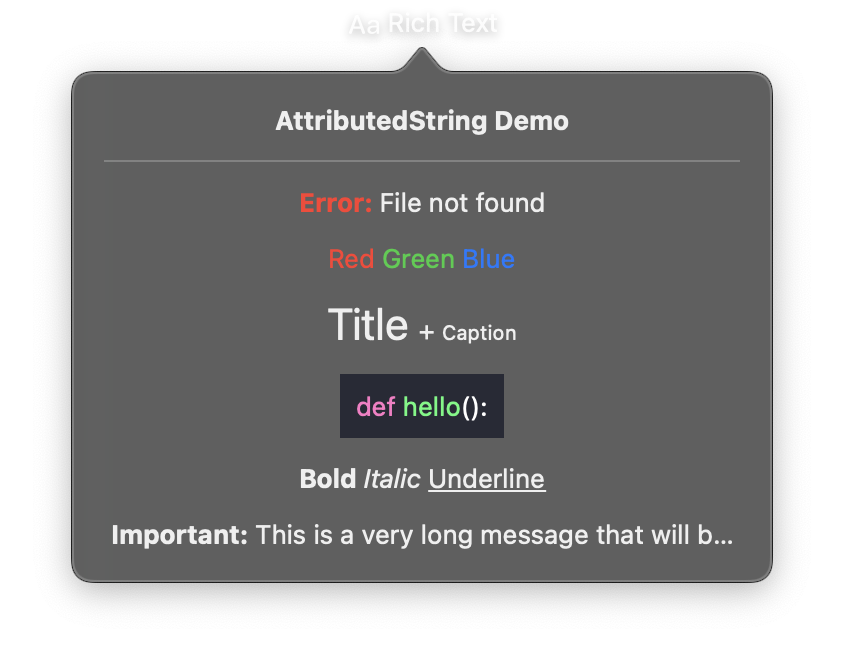

# TextStyle & AttributedString



`TextStyle` is a dataclass that groups all text-related styling options into a single object. `AttributedString` allows creating rich text with different styles for different segments.

```python
import nib

# TextStyle preset
title = nib.Text("Welcome", style=nib.TextStyle.TITLE)

# Custom TextStyle
styled = nib.Text("Custom", style=nib.TextStyle(bold=True, underline=True, color="red"))

# Rich text with AttributedString
rich = nib.Text(strings=[
    nib.AttributedString("Hello ", style=nib.TextStyle(color="blue")),
    nib.AttributedString("World", style=nib.TextStyle(bold=True)),
])
```

---

## TextStyle

The `TextStyle` dataclass combines font, decoration, and spacing properties into a single configuration object. Pass it to a `Text` view using the `style` parameter.

### Constructor

```python
TextStyle(
    font=None, color=None, weight=None,
    bold=False, italic=False,
    strikethrough=False, strikethrough_color=None,
    underline=False, underline_color=None,
    monospaced=False, monospaced_digit=False,
    kerning=None, tracking=None, baseline_offset=None,
)
```

### Parameters

**Font Settings**

| Parameter | Type | Default | Description |
|-----------|------|---------|-------------|
| `font` | `Font` | `None` | Font configuration (e.g., `Font.BODY`, `Font.system(16)`). |
| `color` | `str` | `None` | Text color (hex string or named color). |
| `weight` | `str` | `None` | Font weight string (e.g., `"bold"`, `"medium"`). |

**Text Decorations**

| Parameter | Type | Default | Description |
|-----------|------|---------|-------------|
| `bold` | `bool` | `False` | Apply bold formatting. |
| `italic` | `bool` | `False` | Apply italic formatting. |
| `strikethrough` | `bool` | `False` | Apply strikethrough decoration. |
| `strikethrough_color` | `str` | `None` | Color of the strikethrough line. |
| `underline` | `bool` | `False` | Apply underline decoration. |
| `underline_color` | `str` | `None` | Color of the underline. |

**Font Variations**

| Parameter | Type | Default | Description |
|-----------|------|---------|-------------|
| `monospaced` | `bool` | `False` | Use monospaced font variant. |
| `monospaced_digit` | `bool` | `False` | Use monospaced digits (useful for tabular numbers). |

**Spacing**

| Parameter | Type | Default | Description |
|-----------|------|---------|-------------|
| `kerning` | `float` | `None` | Spacing between character pairs in points. |
| `tracking` | `float` | `None` | Uniform spacing between all characters in points. |
| `baseline_offset` | `float` | `None` | Vertical offset from the text baseline in points. |

### Presets

TextStyle provides predefined presets that match the system semantic font styles:

| Preset | Font Used |
|--------|-----------|
| `TextStyle.LARGE_TITLE` | `Font.LARGE_TITLE` |
| `TextStyle.TITLE` | `Font.TITLE` |
| `TextStyle.TITLE2` | `Font.TITLE2` |
| `TextStyle.TITLE3` | `Font.TITLE3` |
| `TextStyle.HEADLINE` | `Font.HEADLINE` |
| `TextStyle.SUBHEADLINE` | `Font.SUBHEADLINE` |
| `TextStyle.BODY` | `Font.BODY` |
| `TextStyle.CALLOUT` | `Font.CALLOUT` |
| `TextStyle.CAPTION` | `Font.CAPTION` |
| `TextStyle.CAPTION2` | `Font.CAPTION2` |
| `TextStyle.FOOTNOTE` | `Font.FOOTNOTE` |

```python
nib.Text("Title", style=nib.TextStyle.TITLE)
nib.Text("Body text", style=nib.TextStyle.BODY)
```

---

## AttributedString

The `AttributedString` dataclass represents a single styled segment of text. Use it with `Text(strings=[...])` to create rich text with multiple styles.

### Constructor

```python
AttributedString(content, style=None, color=None, font=None)
```

| Parameter | Type | Default | Description |
|-----------|------|---------|-------------|
| `content` | `str` | -- | The text content for this segment. |
| `style` | `TextStyle` | `None` | Full text style configuration. |
| `color` | `Color \| str` | `None` | Color override (takes precedence over `style.color`). |
| `font` | `Font` | `None` | Font override (takes precedence over `style.font`). |

When both `style` and direct overrides (`color`, `font`) are provided, the direct overrides take precedence.

## Examples

### Custom TextStyle with decorations

```python
import nib

def main(app: nib.App):
    app.build(
        nib.VStack(
            controls=[
                nib.Text("Bold & Italic", style=nib.TextStyle(bold=True, italic=True)),
                nib.Text(
                    "Underlined",
                    style=nib.TextStyle(underline=True, underline_color="blue"),
                ),
                nib.Text(
                    "Deleted",
                    style=nib.TextStyle(strikethrough=True, color="gray"),
                ),
                nib.Text(
                    "W I D E",
                    style=nib.TextStyle(tracking=4.0, font=nib.Font.HEADLINE),
                ),
            ],
            spacing=8,
            padding=16,
        )
    )

nib.run(main)
```

### Rich text with AttributedString

```python
import nib

def main(app: nib.App):
    app.build(
        nib.VStack(
            controls=[
                nib.Text(strings=[
                    nib.AttributedString(
                        "Warning: ",
                        style=nib.TextStyle(bold=True, color="red"),
                    ),
                    nib.AttributedString(
                        "This action cannot be undone.",
                        style=nib.TextStyle.BODY,
                    ),
                ]),
                nib.Text(strings=[
                    nib.AttributedString("Price: ", font=nib.Font.BODY),
                    nib.AttributedString(
                        "$9.99",
                        style=nib.TextStyle(
                            font=nib.Font.system(20),
                            bold=True,
                            monospaced_digit=True,
                        ),
                        color=nib.Color.GREEN,
                    ),
                ]),
            ],
            spacing=12,
            padding=16,
        )
    )

nib.run(main)
```

### Monospaced digits for tabular data

```python
import nib

def main(app: nib.App):
    items = [("Apples", 12), ("Oranges", 8), ("Bananas", 145)]
    mono_digit = nib.TextStyle(monospaced_digit=True)

    app.build(
        nib.VStack(
            controls=[
                nib.HStack(
                    controls=[
                        nib.Text(name, font=nib.Font.BODY),
                        nib.Spacer(),
                        nib.Text(str(count), style=mono_digit),
                    ],
                )
                for name, count in items
            ],
            spacing=4,
            padding=16,
        )
    )

nib.run(main)
```
