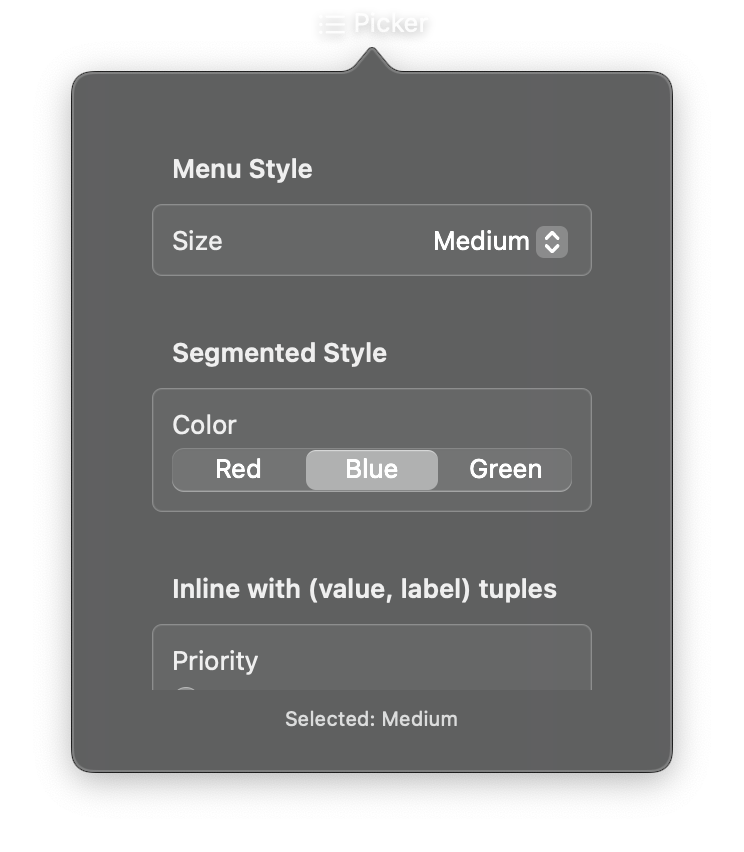

# Picker



A selection control for choosing one option from a predefined set. The picker supports simple string options or `(value, label)` tuples for cases where internal values differ from display text. Multiple visual styles are available, including dropdown menus, segmented controls, and wheels.

## Constructor

```python
nib.Picker(
    label="",
    selection="",
    options=None,
    on_change=None,
    style=None,
    disabled=False,
    **modifiers,
)
```

## Parameters

| Parameter | Type | Default | Description |
|-----------|------|---------|-------------|
| `label` | `str` | `""` | Descriptive label for the picker. Displayed above or beside the options depending on the style. |
| `selection` | `str` | `""` | Currently selected option value. Must match one of the values in the `options` list. |
| `options` | `list[str] \| list[tuple[str, str]]` | `None` | Available options. Can be a list of strings (value equals label) or a list of `(value, label)` tuples for separate internal values and display text. |
| `on_change` | `Callable[[str], None]` | `None` | Callback called when the selection changes. Receives the newly selected value as a string. |
| `style` | `PickerStyle \| str` | `None` | Visual style. Options: `PickerStyle.automatic`, `PickerStyle.menu`, `PickerStyle.segmented`, `PickerStyle.wheel`, `PickerStyle.inline`. |
| `disabled` | `bool` | `False` | Whether the picker is disabled and non-interactive. |
| `**modifiers` | | | Common view modifiers: `padding`, `background`, `foreground_color`, `opacity`, etc. |

## Mutable Properties

| Property | Type | Description |
|----------|------|-------------|
| `selection` | `str` | Get or set the currently selected value. |
| `options` | `list` | Get or set the list of available options. |
| `on_change` | `Callable` | Get or set the selection change callback. |

## Examples

### Dropdown menu picker

```python
import nib

def main(app: nib.App):
    result = nib.Text("Selected: Red")

    app.build(
        nib.VStack(controls=[
            nib.Picker(
                "Favorite Color",
                selection="Red",
                options=["Red", "Green", "Blue", "Yellow"],
                on_change=lambda v: setattr(
                    result, "content", f"Selected: {v}"
                ),
            ),
            result,
        ], spacing=12, padding=16)
    )

nib.run(main)
```

### Segmented control

```python
import nib

def main(app: nib.App):
    content = nib.Text("Showing Day view")

    def switch_view(mode: str):
        content.content = f"Showing {mode} view"

    app.build(
        nib.VStack(controls=[
            nib.Picker(
                "",
                selection="Day",
                options=["Day", "Week", "Month"],
                on_change=switch_view,
                style=nib.PickerStyle.segmented,
            ),
            content,
        ], spacing=12, padding=16)
    )

nib.run(main)
```

### Picker with value-label tuples

```python
import nib

def main(app: nib.App):
    size_label = nib.Text("Size: m")

    app.build(
        nib.VStack(controls=[
            nib.Picker(
                "T-Shirt Size",
                selection="m",
                options=[
                    ("xs", "Extra Small"),
                    ("s", "Small"),
                    ("m", "Medium"),
                    ("l", "Large"),
                    ("xl", "Extra Large"),
                ],
                on_change=lambda v: setattr(
                    size_label, "content", f"Size: {v}"
                ),
                style=nib.PickerStyle.menu,
            ),
            size_label,
        ], spacing=12, padding=16)
    )

nib.run(main)
```
