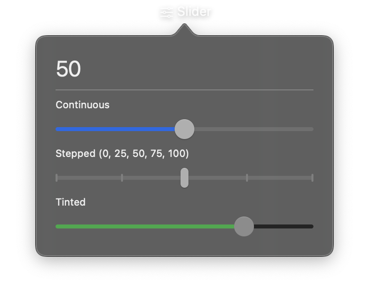

# Slider



A horizontal track with a draggable thumb for selecting a numeric value within a range. The slider supports continuous values or discrete steps when a `step` increment is specified.

## Constructor

```python
nib.Slider(
    value=0,
    min_value=0,
    max_value=1,
    step=None,
    label="",
    on_change=None,
    tint=None,
    disabled=False,
    **modifiers,
)
```

## Parameters

| Parameter | Type | Default | Description |
|-----------|------|---------|-------------|
| `value` | `float` | `0` | Initial value of the slider. Must be between `min_value` and `max_value`. |
| `min_value` | `float` | `0` | Minimum value of the range. |
| `max_value` | `float` | `1` | Maximum value of the range. |
| `step` | `float` | `None` | Step increment for discrete values. When set, the slider snaps to multiples of this value. When `None`, values are continuous. |
| `label` | `str` | `""` | Optional text label displayed with the slider. |
| `on_change` | `Callable[[float], None]` | `None` | Callback called continuously as the slider value changes. Receives the new float value. |
| `tint` | `Color \| str` | `None` | Tint color for the filled portion of the slider track. Accepts a `Color` enum, hex string, or RGB tuple. |
| `disabled` | `bool` | `False` | Whether the slider is disabled and non-interactive. |
| `**modifiers` | | | Common view modifiers: `padding`, `background`, `opacity`, `width`, etc. |

## Examples

### Volume control

```python
import nib

def main(app: nib.App):
    volume_label = nib.Text("Volume: 50%")

    def on_volume(value: float):
        volume_label.content = f"Volume: {int(value)}%"

    app.build(
        nib.VStack(controls=[
            volume_label,
            nib.Slider(
                value=50,
                min_value=0,
                max_value=100,
                on_change=on_volume,
                tint=nib.Color.BLUE,
                width=250,
            ),
        ], spacing=8, padding=16)
    )

nib.run(main)
```

### Rating slider with discrete steps

```python
import nib

def main(app: nib.App):
    rating_text = nib.Text("Rating: 3")

    def on_rating(value: float):
        rating_text.content = f"Rating: {int(value)}"

    app.build(
        nib.VStack(controls=[
            rating_text,
            nib.Slider(
                value=3,
                min_value=1,
                max_value=5,
                step=1,
                label="Rating",
                on_change=on_rating,
                tint=nib.Color.YELLOW,
                width=200,
            ),
        ], spacing=8, padding=16)
    )

nib.run(main)
```

### Brightness control

```python
import nib

def main(app: nib.App):
    app.build(
        nib.HStack(controls=[
            nib.Label("Brightness", icon="sun.min"),
            nib.Slider(
                value=75,
                min_value=0,
                max_value=100,
                step=5,
                on_change=lambda v: print(f"Brightness: {int(v)}%"),
                tint=nib.Color.ORANGE,
            ),
            nib.Label("", icon="sun.max"),
        ], spacing=8, padding=16)
    )

nib.run(main)
```
