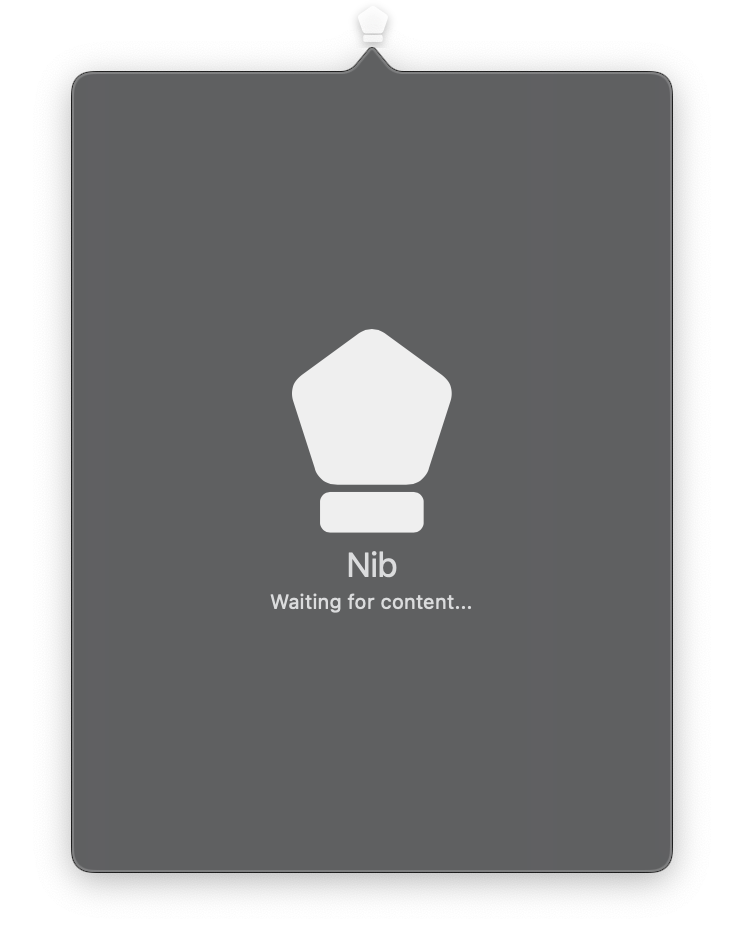

# Canvas



A drawing surface for freeform 2D rendering using Core Graphics. Canvas accepts a list of declarative drawing commands (shapes, images, text) and renders them with GPU acceleration on macOS.

The canvas is reactive -- calling `draw()`, `append()`, or `clear()` triggers an immediate re-render. Gesture callbacks enable interactive drawing applications such as freehand sketching or annotation tools.

For the full list of drawing commands, see the [Draw Module Reference](../../draw/index.md).

## Constructor

```python
nib.Canvas(
    width=100,
    height=100,
    commands=None,
    background_color=None,
    enable_gestures=False,
    on_pan_start=None,
    on_pan_update=None,
    on_pan_end=None,
    on_hover=None,
    **modifiers,
)
```

## Parameters

| Parameter | Type | Default | Description |
|-----------|------|---------|-------------|
| `width` | `float` | `100` | Width of the canvas drawing area in points. |
| `height` | `float` | `100` | Height of the canvas drawing area in points. |
| `commands` | `list[DrawCommand]` | `None` | Initial list of drawing commands to render. |
| `background_color` | `str` | `None` | Background color as a hex string (e.g., `"#1a1a1a"`). `None` for transparent. |
| `enable_gestures` | `bool` | `False` | Enable pan/hover gesture tracking. Automatically enabled when any gesture callback is set. |
| `on_pan_start` | `Callable[[PanEvent], None]` | `None` | Callback invoked when mouse/pen is pressed down on the canvas. |
| `on_pan_update` | `Callable[[PanEvent], None]` | `None` | Callback invoked when mouse/pen is dragged across the canvas. |
| `on_pan_end` | `Callable[[PanEvent], None]` | `None` | Callback invoked when mouse/pen is released. |
| `on_hover` | `Callable[[PanEvent], None]` | `None` | Callback invoked when the mouse moves over the canvas without pressing. |
| `**modifiers` | | | Common view modifiers: `padding`, `opacity`, `corner_radius`, etc. |

## Mutable Properties

| Property | Type | Description |
|----------|------|-------------|
| `canvas_width` | `float` | Get or set the drawing area width. Setting triggers a re-render. |
| `canvas_height` | `float` | Get or set the drawing area height. Setting triggers a re-render. |
| `background_color` | `str \| None` | Get or set the background color. |
| `commands` | `list[DrawCommand]` | Get the current list of drawing commands (read-only). |
| `on_pan_start` | `Callable \| None` | Get or set the pan start callback. Setting a callback auto-enables gestures. |
| `on_pan_update` | `Callable \| None` | Get or set the pan update callback. |
| `on_pan_end` | `Callable \| None` | Get or set the pan end callback. |
| `on_hover` | `Callable \| None` | Get or set the hover callback. |

## Methods

| Method | Signature | Description |
|--------|-----------|-------------|
| `draw` | `draw(commands: list[DrawCommand])` | Replace all drawing commands and re-render. |
| `append` | `append(command: DrawCommand)` | Add a single drawing command and re-render. |
| `clear` | `clear()` | Remove all drawing commands and re-render. |

## PanEvent

A dataclass passed to gesture callbacks containing the pointer position.

| Field | Type | Description |
|-------|------|-------------|
| `x` | `float` | X coordinate of the event in canvas coordinates. |
| `y` | `float` | Y coordinate of the event in canvas coordinates. |

## Examples

### Basic drawing

```python
import nib

def main(app: nib.App):
    canvas = nib.Canvas(width=400, height=300, background_color="#1a1a1a")
    canvas.draw([
        nib.draw.Rect(x=10, y=10, width=100, height=50, fill="#3498db"),
        nib.draw.Circle(cx=200, cy=100, radius=40, fill="#e74c3c"),
        nib.draw.Text("Hello Canvas!", x=10, y=280, fill="#ffffff"),
    ])

    app.build(canvas)

nib.run(main)
```

### Freehand drawing with gestures

```python
import nib

def main(app: nib.App):
    canvas = nib.Canvas(width=400, height=300, background_color="#ffffff")
    last_pos = None

    def on_pan_start(e):
        nonlocal last_pos
        last_pos = (e.x, e.y)

    def on_pan_update(e):
        nonlocal last_pos
        canvas.append(nib.draw.Line(
            x1=last_pos[0], y1=last_pos[1],
            x2=e.x, y2=e.y,
            stroke="#000000", stroke_width=3,
        ))
        last_pos = (e.x, e.y)

    canvas.on_pan_start = on_pan_start
    canvas.on_pan_update = on_pan_update

    app.build(
        nib.VStack(controls=[
            canvas,
            nib.Button("Clear", action=canvas.clear),
        ], spacing=8, padding=16)
    )

nib.run(main)
```

### Drawing with gradients

```python
import nib

def main(app: nib.App):
    canvas = nib.Canvas(width=400, height=300)
    canvas.draw([
        nib.draw.Rect(
            x=10, y=10, width=180, height=130,
            fill=nib.draw.LinearGradient(
                start=(10, 10), end=(190, 140),
                colors=["#FF0000", "#0000FF"],
            ),
            corner_radius=8,
        ),
        nib.draw.Circle(
            cx=300, cy=100, radius=60,
            fill=nib.draw.RadialGradient(
                center=(300, 100), radius=60,
                colors=["#FFFF00", "#FF0000"],
            ),
        ),
    ])

    app.build(canvas)

nib.run(main)
```

### Interactive dot painting

```python
import nib

def main(app: nib.App):
    canvas = nib.Canvas(width=400, height=300, background_color="#f5f5f5")

    def on_pan_update(e):
        canvas.append(
            nib.draw.Circle(cx=e.x, cy=e.y, radius=5, fill="#3B82F6")
        )

    canvas.on_pan_update = on_pan_update
    app.build(canvas)

nib.run(main)
```
