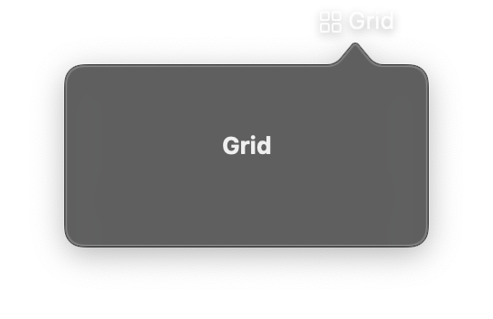

# Grid & GridRow



Grid arranges views in a fixed two-dimensional layout with explicit row and column structure. Unlike `LazyVGrid` and `LazyHGrid`, Grid sizes all views immediately rather than lazily.

Use `GridRow` to define individual rows within the grid. The number of columns is determined by the row with the most children.

## Constructor

```python
nib.Grid(
    controls=None,
    alignment=None,
    horizontal_spacing=None,
    vertical_spacing=None,
    **modifiers,
)
```

```python
nib.GridRow(
    controls=None,
    alignment=None,
    **modifiers,
)
```

## Parameters

### Grid

| Parameter | Type | Default | Description |
|-----------|------|---------|-------------|
| `controls` | `list[View]` | `None` | Child views, typically `GridRow` elements that define the grid structure. |
| `alignment` | `str` | `None` | Default alignment for all cells in the grid. |
| `horizontal_spacing` | `float` | `None` | Spacing in points between columns. |
| `vertical_spacing` | `float` | `None` | Spacing in points between rows. |
| `**modifiers` | | | Common view modifiers: `padding`, `background`, `width`, `height`, etc. |

### GridRow

| Parameter | Type | Default | Description |
|-----------|------|---------|-------------|
| `controls` | `list[View]` | `None` | Views in this row. Each view occupies one column. |
| `alignment` | `str` | `None` | Vertical alignment for this specific row, overriding the grid default. |
| `**modifiers` | | | Common view modifiers. |

## Mutable Properties

| Property | Type | Description |
|----------|------|-------------|
| `controls` | `list[View]` | Get or set the child views (on both Grid and GridRow). Setting triggers a UI update. |

## Examples

### Simple 2x2 grid

```python
import nib

def main(app: nib.App):
    app.build(
        nib.Grid(
            controls=[
                nib.GridRow(controls=[
                    nib.Text("A", padding=8),
                    nib.Text("B", padding=8),
                ]),
                nib.GridRow(controls=[
                    nib.Text("C", padding=8),
                    nib.Text("D", padding=8),
                ]),
            ],
            horizontal_spacing=10,
            vertical_spacing=10,
            padding=16,
        )
    )

nib.run(main)
```

### Label-value grid

Grid works well for creating aligned label-value pairs.

```python
import nib

def main(app: nib.App):
    app.build(
        nib.Grid(
            controls=[
                nib.GridRow(
                    controls=[
                        nib.Text("Name:", foreground_color=nib.Color.SECONDARY),
                        nib.Text("Nib Framework"),
                    ],
                    alignment="center",
                ),
                nib.GridRow(
                    controls=[
                        nib.Text("Version:", foreground_color=nib.Color.SECONDARY),
                        nib.Text("1.0.0"),
                    ],
                    alignment="center",
                ),
                nib.GridRow(
                    controls=[
                        nib.Text("Platform:", foreground_color=nib.Color.SECONDARY),
                        nib.Text("macOS"),
                    ],
                    alignment="center",
                ),
            ],
            horizontal_spacing=16,
            vertical_spacing=8,
            padding=16,
        )
    )

nib.run(main)
```

### Grid with mixed content

```python
import nib

def main(app: nib.App):
    app.build(
        nib.Grid(
            controls=[
                nib.GridRow(controls=[
                    nib.Image(system_name="star.fill"),
                    nib.Text("Favorites"),
                    nib.Text("12"),
                ]),
                nib.GridRow(controls=[
                    nib.Image(system_name="clock.fill"),
                    nib.Text("Recent"),
                    nib.Text("5"),
                ]),
                nib.GridRow(controls=[
                    nib.Image(system_name="folder.fill"),
                    nib.Text("Documents"),
                    nib.Text("34"),
                ]),
            ],
            horizontal_spacing=12,
            vertical_spacing=8,
            padding=16,
        )
    )

nib.run(main)
```
